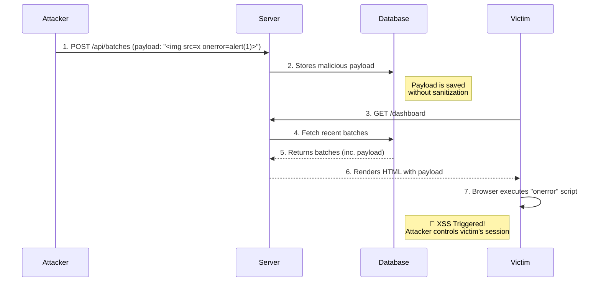

# 🛡️ Security Assessment Report: Stored Cross-Site Scripting (XSS)

> [!CAUTION]
> **CRITICAL VULNERABILITY DETECTED**
> A Stored XSS vulnerability allows attackers to execute arbitrary JavaScript in the context of other users' sessions.
> **Immediate Action Required.**

## 📊 Vulnerability Snapshot

| Metric | Details |
| :--- | :--- |
| **Vulnerability Type** | Stored Cross-Site Scripting (XSS) |
| **Severity** | 🔴 **Critical** |
| **Affected Endpoint** | `/add-batch` (Create New Batch Form) |
| **Vulnerable Parameter** | `Batch Name` input field |
| **Impact** | Session Hijacking, Data Theft, Phishing |

---

## 🔍 Attack Flow Analysis

The following diagram illustrates how the exploited Stored XSS vulnerability propagates from the attacker to the victim.



---

## 💥 Proof of Concept (PoC)

To validate the vulnerability, the following payload was successfully injected and executed:

### Injection Vector
**Location**: `http://localhost:4201/add-batch`
**Field**: `Batch Name`

```html
<!-- Malicious Payload Injected -->

```

> [!IMPORTANT]
> **Observation**: Upon navigating to the Dashboard, the payload executed immediately, displaying an alert box with the text `XSS_ATTACK`. This confirms the application renders user input directly into the DOM without escaping.

---

## 💻 Vulnerable Code Analysis

The vulnerability stems from the explicit bypass of Angular's built-in strict strict Contextual Escaping (SCE) in `src/app/features/dashboard/dashboard.ts`.

### The Culprit
The application defines a `trustHtml` method that uses `DomSanitizer.bypassSecurityTrustHtml`. This tells Angular to trust the input explicitly, disabling all sanitization.

```typescript
// src/app/features/dashboard/dashboard.ts

export class DashboardComponent {
  private sanitizer = inject(DomSanitizer);

  // 🚨 DANGER: This method bypasses security checks!
  trustHtml(html: string) {
    return this.sanitizer.bypassSecurityTrustHtml(html);
  }
}
```

### Unsafe Rendering
In the template, this method is used directly on user-controlled input (`batch.name`) via the `[innerHTML]` property binding.

```html
<!-- src/app/features/dashboard/dashboard.ts (template) -->

<div class="card-header">
  <!-- ... -->
  
  <!-- ❌ VULNERABLE: batch.name contains the attacker's payload -->
  <h3 [innerHTML]="trustHtml(batch.name)"></h3>
  
  <!-- ... -->
</div>
```

---

## 🛡️ Remediation Strategy

To secure the application, we recommend a multi-layered defense-in-depth approach.

### 1. Input Sanitization & Output Encoding (Required)

Ensure all user input is sanitized before storage and encoded before rendering.

| Logic Layer | Recommendation |
| :--- | :--- |
| **Frontend (Angular)** | Rely on default interpolation `{{ value }}`. **Never** use `innerHTML` with untrusted data. |
| **Frontend (React)** | Use `{value}`. Avoid `dangerouslySetInnerHTML`. |
| **Backend** | Sanitize inputs using libraries like DOMPurify before saving to the database. |

### 2. Implement Content Security Policy (CSP)

A robust CSP can prevent the execution of unauthorized scripts.

```http
Content-Security-Policy: default-src 'self'; script-src 'self' https://trusted.cdn.com; object-src 'none';
```

> [!TIP]
> **Developer Note**: Start with a `Report-Only` policy to monitor potential violations before enforcing blocking rules to avoid breaking legitimate functionality.

---

## 📝 Conclusion
The "Create New Batch" form exhibits a **Critical** security flaw. The lack of input sanitization allows for trivial exploitation of Stored XSS. We strongly advise prioritizing the remediation steps outlined above to protect user integrity and data security.
